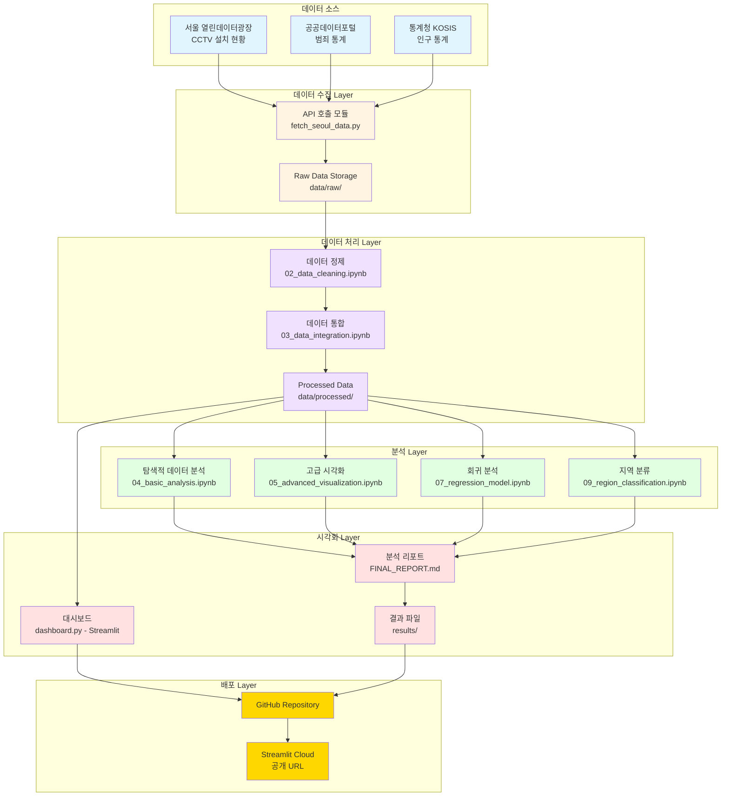

# 프로젝트 아키텍처 및 데이터 플로우 다이어그램

## 📐 다이어그램 종류

이 파일에는 3가지 주요 다이어그램이 포함되어 있습니다:
1. **시스템 아키텍처**: 전체 시스템 구조
2. **데이터 파이프라인**: 데이터 처리 흐름
3. **데이터 플로우**: 세부 데이터 변환 과정

---

## 🏗️ 시스템 아키텍처

---

## 🔄 데이터 파이프라인

---

## 📊 데이터 플로우 (상세)

---

## 🎨 대시보드 구조

---

## 🔧 기술 스택

```mermaid
graph LR
    subgraph "Backend"
        A[Python 3.8+]
        B[pandas]
        C[numpy]
        D[scipy]
    end

    subgraph "Visualization"
        E[matplotlib]
        F[seaborn]
        G[plotly]
        H[Streamlit]
    end

    subgraph "Analysis"
        I[statsmodels]
        J[scikit-learn]
    end

    subgraph "Data Source"
        K[REST API]
        L[CSV Files]
    end

    subgraph "Deployment"
        M[GitHub]
        N[Streamlit Cloud]
    end

    K --> A
    L --> A
    A --> B
    A --> C
    A --> D
    B --> E
    B --> F
    B --> G
    B --> H
    C --> I
    D --> I
    B --> J
    H --> M
    M --> N

    style A fill:#3776AB,color:#fff
    style B fill:#150458,color:#fff
    style C fill:#013243,color:#fff
    style E fill:#11557C,color:#fff
    style G fill:#3F4F75,color:#fff
    style H fill:#FF4B4B,color:#fff
    style M fill:#181717,color:#fff
    style N fill:#FF4B4B,color:#fff
```

---

## 📈 분석 워크플로우

---

## 💡 사용 방법

### GitHub에서 보기
이 다이어그램들은 GitHub에서 자동으로 렌더링됩니다.
- README.md에 포함하면 바로 볼 수 있습니다
- Mermaid 형식으로 작성되어 버전 관리 가능

### 이미지로 저장
1. GitHub에서 다이어그램 우클릭
2. "다른 이름으로 이미지 저장"
3. 프레젠테이션, 포트폴리오에 활용

### 수정 방법
1. 마크다운 파일 편집
2. Mermaid 문법으로 수정
3. GitHub에서 미리보기 확인

---

## 🎓 다이어그램 설명

### 시스템 아키텍처
- 5개 Layer로 구성된 전체 시스템 구조
- 데이터 소스 → 수집 → 처리 → 분석 → 시각화 → 배포

### 데이터 파이프라인
- ETL (Extract-Transform-Load) 프로세스
- 각 단계별 데이터 변환 과정 표시

### 데이터 플로우
- 가장 상세한 흐름도
- 의사결정 포인트 포함
- 파일 경로 및 처리 로직 명시

### 대시보드 구조
- Streamlit 앱의 컴포넌트 구조
- 사용자 인터랙션 흐름

### 기술 스택
- 사용된 모든 라이브러리와 도구
- 계층별 기술 분류

### 분석 워크플로우
- State Diagram으로 분석 과정의 상태 변화 표현
- 각 단계의 세부 프로세스 포함

---

**Made with Mermaid** 📊
